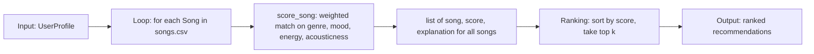

# 🎵 Music Recommender Simulation

## Project Summary

In this project you will build and explain a small music recommender system.

Your goal is to:

- Represent songs and a user "taste profile" as data
- Design a scoring rule that turns that data into recommendations
- Evaluate what your system gets right and wrong
- Reflect on how this mirrors real world AI recommenders

Replace this paragraph with your own summary of what your version does.

---

## How The System Works

Real streaming platforms like Spotify blend two approaches: **collaborative filtering**,
which predicts what you'll like based on what similar *users* listened to, and
**content-based filtering**, which predicts based on the *attributes* of the songs
themselves (genre, tempo, energy, mood). Collaborative filtering needs a large history
of user interactions (likes, skips, playlist adds) to find "taste neighbors," while
content-based filtering can score a brand-new song the moment its attributes are known.
Since this simulation only has song metadata and no interaction history, it is a
**content-based recommender**: it scores every song by how closely its attributes match
a single user's stated taste profile, rather than by what other simulated users did.

**`Song` features used:**
- `genre` (categorical, e.g. pop, lofi, jazz)
- `mood` (categorical, e.g. happy, chill, intense)
- `energy` (numeric, 0-1)
- `tempo_bpm` (numeric)
- `valence` (numeric, 0-1 — musical positivity)
- `danceability` (numeric, 0-1)
- `acousticness` (numeric, 0-1)

**`UserProfile` stores:**
- `favorite_genre`
- `favorite_mood`
- `target_energy` (the energy level the user wants, not just "higher is better")
- `likes_acoustic` (boolean)

**How `Recommender` scores a song:** it awards points for a matching genre, a matching
mood, closeness between the song's energy and the user's `target_energy` (scored as
`1 - abs(song.energy - user.target_energy)` so songs near the target score highest, not
just high-energy songs), and a bonus if the user likes acoustic music and the song's
`acousticness` is high. Genre outweighs mood because it's a broader, more stable signal
of taste than a momentary vibe.

**How songs are ranked:** the scoring rule only judges one song in isolation. The
ranking rule takes the scores for the *whole* catalog, sorts them highest to lowest,
and returns the top `k` — turning individual scores into an actual ordered
recommendation list.

### Algorithm Recipe (finalized)

| Signal | Points |
|---|---|
| Genre match | `+2.0` |
| Mood match | `+1.0` |
| Energy closeness | `+1.0 × (1 - abs(song.energy - user.target_energy))` |
| Likes acoustic & `acousticness > 0.6` | `+0.5` |

Example user profile used for testing:

```python
user_profile = {
    "favorite_genre": "rock",
    "favorite_mood": "intense",
    "target_energy": 0.85,
    "likes_acoustic": False,
}
```

### Data Flow



### Expected Bias

This system likely over-prioritizes **genre** (worth 2x a mood match), so a song that's a
near-perfect mood/energy match but a different genre can lose to a same-genre song that
matches the user's mood poorly. It may also under-serve users whose taste doesn't fit
neatly into one `favorite_genre`/`favorite_mood` pair, since the profile can't express
"I like rock *or* jazz" or partial preferences.

---

## Getting Started

### Setup

1. Create a virtual environment (optional but recommended):

   ```bash
   python -m venv .venv
   source .venv/bin/activate      # Mac or Linux
   .venv\Scripts\activate         # Windows

2. Install dependencies

```bash
pip install -r requirements.txt
```

3. Run the app:

```bash
python -m src.main
```

### Running Tests

Run the starter tests with:

```bash
pytest
```

You can add more tests in `tests/test_recommender.py`.

---

## Sample Recommendation Output

Output of `python -m src.main` for the default `genre=pop, mood=happy, energy=0.8` profile:

```
Loading songs from data/songs.csv...
Loaded songs: 18

User profile: genre=pop, mood=happy, energy=0.8

Top recommendations:

1. Sunrise City — Neon Echo (pop/happy)
   Score: 3.98
   Because: genre match (+2.0), mood match (+1.0), energy closeness (+0.98)

2. Gym Hero — Max Pulse (pop/intense)
   Score: 2.87
   Because: genre match (+2.0), energy closeness (+0.87)

3. Rooftop Lights — Indigo Parade (indie pop/happy)
   Score: 1.96
   Because: mood match (+1.0), energy closeness (+0.96)

4. Night Drive Loop — Neon Echo (synthwave/moody)
   Score: 0.95
   Because: energy closeness (+0.95)

5. Sunset Highway — Coral Drift (house/euphoric)
   Score: 0.92
   Because: energy closeness (+0.92)
```

**Screenshot or video** *(optional)*: <!-- Insert a screenshot or demo video link here -->

---

## Experiments You Tried

Use this section to document the experiments you ran. For example:

- What happened when you changed the weight on genre from 2.0 to 0.5
- What happened when you added tempo or valence to the score
- How did your system behave for different types of users

---

## Limitations and Risks

Summarize some limitations of your recommender.

Examples:

- It only works on a tiny catalog
- It does not understand lyrics or language
- It might over favor one genre or mood

You will go deeper on this in your model card.

---

## Reflection

Read and complete `model_card.md`:

[**Model Card**](model_card.md)

Write 1 to 2 paragraphs here about what you learned:

- about how recommenders turn data into predictions
- about where bias or unfairness could show up in systems like this


