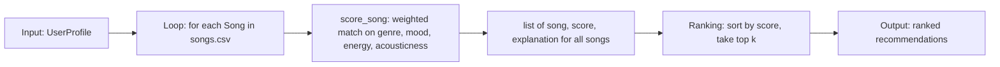

# 🎵 Music Recommender Simulation

## Project Summary

In this project you will build and explain a small music recommender system.

Your goal is to:

- Represent songs and a user "taste profile" as data
- Design a scoring rule that turns that data into recommendations
- Evaluate what your system gets right and wrong
- Reflect on how this mirrors real world AI recommenders

This version is a content-based recommender: it scores an 18-song catalog against a single
user's taste profile (favorite genre, favorite mood, target energy, and whether they like
acoustic music), ranks the catalog by that score, and explains each recommendation with a
breakdown of which signals earned it points. It has been stress-tested against several
contrasting profiles — including one adversarial profile with deliberately conflicting
signals — to see where the scoring logic holds up and where it breaks down.

---

## How The System Works

Real streaming platforms like Spotify blend two approaches: **collaborative filtering**,
which predicts what you'll like based on what similar *users* listened to, and
**content-based filtering**, which predicts based on the *attributes* of the songs
themselves (genre, tempo, energy, mood). Collaborative filtering needs a large history
of user interactions (likes, skips, playlist adds) to find "taste neighbors," while
content-based filtering can score a brand-new song the moment its attributes are known.
Since this simulation only has song metadata and no interaction history, it is a
**content-based recommender**: it scores every song by how closely its attributes match
a single user's stated taste profile, rather than by what other simulated users did.

**`Song` features used:**
- `genre` (categorical, e.g. pop, lofi, jazz)
- `mood` (categorical, e.g. happy, chill, intense)
- `energy` (numeric, 0-1)
- `tempo_bpm` (numeric)
- `valence` (numeric, 0-1 — musical positivity)
- `danceability` (numeric, 0-1)
- `acousticness` (numeric, 0-1)

**`UserProfile` stores:**
- `favorite_genre`
- `favorite_mood`
- `target_energy` (the energy level the user wants, not just "higher is better")
- `likes_acoustic` (boolean)

**How `Recommender` scores a song:** it awards points for a matching genre, a matching
mood, closeness between the song's energy and the user's `target_energy` (scored as
`1 - abs(song.energy - user.target_energy)` so songs near the target score highest, not
just high-energy songs), and a bonus if the user likes acoustic music and the song's
`acousticness` is high. Genre outweighs mood because it's a broader, more stable signal
of taste than a momentary vibe.

**How songs are ranked:** the scoring rule only judges one song in isolation. The
ranking rule takes the scores for the *whole* catalog, sorts them highest to lowest,
and returns the top `k` — turning individual scores into an actual ordered
recommendation list.

### Algorithm Recipe (finalized)

| Signal | Points |
|---|---|
| Genre match | `+2.0` |
| Mood match | `+1.0` |
| Energy closeness | `+1.0 × (1 - abs(song.energy - user.target_energy))` |
| Likes acoustic & `acousticness > 0.6` | `+0.5` |

Example user profile used for testing:

```python
user_profile = {
    "favorite_genre": "rock",
    "favorite_mood": "intense",
    "target_energy": 0.85,
    "likes_acoustic": False,
}
```

### Data Flow



### Expected Bias

This system likely over-prioritizes **genre** (worth 2x a mood match), so a song that's a
near-perfect mood/energy match but a different genre can lose to a same-genre song that
matches the user's mood poorly. It may also under-serve users whose taste doesn't fit
neatly into one `favorite_genre`/`favorite_mood` pair, since the profile can't express
"I like rock *or* jazz" or partial preferences.

---

## Getting Started

### Setup

1. Create a virtual environment (optional but recommended):

   ```bash
   python -m venv .venv
   source .venv/bin/activate      # Mac or Linux
   .venv\Scripts\activate         # Windows

2. Install dependencies

```bash
pip install -r requirements.txt
```

3. Run the app:

```bash
python -m src.main
```

### Running Tests

Run the starter tests with:

```bash
pytest
```

You can add more tests in `tests/test_recommender.py`.

---

## Sample Recommendation Output

Output of `python -m src.main` for the default `genre=pop, mood=happy, energy=0.8` profile:

```
Loading songs from data/songs.csv...
Loaded songs: 18

User profile: genre=pop, mood=happy, energy=0.8

Top recommendations:

1. Sunrise City — Neon Echo (pop/happy)
   Score: 3.98
   Because: genre match (+2.0), mood match (+1.0), energy closeness (+0.98)

2. Gym Hero — Max Pulse (pop/intense)
   Score: 2.87
   Because: genre match (+2.0), energy closeness (+0.87)

3. Rooftop Lights — Indigo Parade (indie pop/happy)
   Score: 1.96
   Because: mood match (+1.0), energy closeness (+0.96)

4. Night Drive Loop — Neon Echo (synthwave/moody)
   Score: 0.95
   Because: energy closeness (+0.95)

5. Sunset Highway — Coral Drift (house/euphoric)
   Score: 0.92
   Because: energy closeness (+0.92)
```

**Screenshot or video** *(optional)*: <!-- Insert a screenshot or demo video link here -->

---

## Experiments You Tried

**Weight shift:** halved the genre-match weight (2.0 → 1.0) and doubled the energy-closeness
multiplier (1.0 → 2.0), then re-ran the "High-Energy Pop" and "Deep Intense Rock" profiles.

```
Deep Intense Rock — original weights          Deep Intense Rock — shifted weights
1. Storm Runner       3.94                     1. Storm Runner       3.88
2. Gym Hero           1.92                     2. Gym Hero           2.84
3. Sunrise City       0.97                     3. Sunrise City       1.94
4. Sunset Highway     0.97                     4. Sunset Highway     1.94
5. Rooftop Lights     0.91                     5. Rooftop Lights     1.82
```

Surprisingly, the **top-5 ordering didn't change at all** for either profile — only the score
gaps between songs compressed (e.g. Gym Hero vs. Rooftop Lights went from a 1.11-point gap
to a 0.22-point gap). A genre+mood match (worth 2.0 combined under either weighting) still
narrowly edges out an energy-only match, because no song in the catalog scores purely on
energy closeness alone high enough to leapfrog a genre or mood match. This suggests our
18-song catalog isn't diverse enough to reveal how sensitive the ranking really is to this
weight — a bigger, more varied catalog would likely show bigger swings.

**How the system behaves for different user types:** see the four stress-test profiles
(and their full output) in `model_card.md`'s Evaluation section — "Chill Lofi" and "Deep
Intense Rock" both get confident, well-matched top picks, while the adversarial
"High-Energy Melancholy" profile exposes a real weakness (see Limitations below).

---

## Limitations and Risks

- **Tiny catalog:** 18 songs total, and most genres appear only once — there's rarely more
  than one or two "right answers" for any given profile, so the recommender can't show real
  diversity within a taste.
- **Exact-string genre/mood matching:** `"pop"` and `"indie pop"` are treated as completely
  unrelated, even though "Rooftop Lights" (indie pop/happy) is a close conceptual match for a
  pop/happy profile. The system has no concept of genre similarity or hierarchy.
- **Conflicting preferences produce a "least-bad" answer, not a good one:** the adversarial
  "High-Energy Melancholy" profile (genre=classical, mood=melancholy, energy=0.9) still
  returns the one classical/melancholy song in the catalog as the top pick, even though its
  actual energy (0.20) is nowhere close to the requested 0.9 — the flat +2.0/+1.0 genre and
  mood bonuses dominate over the energy term (capped at +1.0), so the system can't tell the
  difference between "great match with one contradictory feature" and "great match, full
  stop."
- **No sense of lyrics, language, or cultural context** — everything is numeric/categorical
  metadata (genre, mood, energy, tempo, valence, danceability, acousticness).
- **Single-profile assumption:** `UserProfile` can only express one favorite genre and one
  favorite mood, so it can't represent "I like rock *or* jazz" or a user whose taste spans
  multiple moods.

See `model_card.md` for a deeper discussion of bias and future improvements.

---

## Reflection

Read and complete `model_card.md`:

[**Model Card**](model_card.md)

Building even this small a recommender made it obvious how much a "prediction" is really
just an arithmetic tally in disguise — every recommendation the system makes boils down to a
handful of `+2.0`, `+1.0`, and `+0.98`-style additions, sorted. There's no understanding of
music happening anywhere; there's a scoring rule that happens to *feel* like taste because
the weights were chosen by a human who does understand music. That's a useful reminder for
real systems too: the "intelligence" people attribute to a recommender is often really the
designer's judgment about which signals matter, baked into a formula.

The clearest place bias shows up here is the adversarial profile test: because genre and
mood matches are flat bonuses that don't scale with how *well* they match, the system can't
distinguish "a great match with one contradictory feature" from "a great match, full stop."
In a real system, that same blind spot could mean a user who mostly listens to one genre but
is in an unusual mood gets steamrolled into more of the same — a small-scale example of the
filter-bubble effect where a system's rigid model of "what you like" crowds out anything
that doesn't fit the profile it already has for you.


